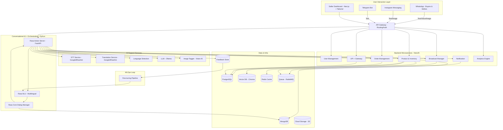

# System Architecture: Kadai

**Version:** 1.0
**Date:** June 8, 2025
**Author:** Gemini (AI Assistant, in collaboration with User)
**Status:** Finalized for Development

---

## 1. Overview

Kadai is a multimodal, multilingual AI sales assistant for conversational commerce, designed for individual sellers and family businesses in India. This architecture supports voice/image/text inputs, instant AI replies, UPI-enabled ordering, and seller dashboards.

> **Update (Multichannel):**
> Kadai is now architected as a **multichannel platform** — starting with WhatsApp, Instagram Messaging, and Telegram, with a flexible design to support additional messaging platforms (e.g., Facebook Messenger, Google Business Messages) through a pluggable adapter layer.

---

## 2. Architectural Principles

- **Microservices-first** with NestJS
- **LLM-enabled orchestration** via Python (FastAPI)
- **Multilingual & Multimodal inputs** (text, voice, image)
- **Cost-efficient & scalable** deployment
- **Guardrails, analytics, feedback loop** built-in
- **Channel-agnostic messaging orchestration** through unified integration layer

---

## 3. High-Level Architecture Diagram

---

## 4. Services & Layers

### 4.1 User Interaction

- **WhatsApp, Instagram, Telegram:** Multichannel endpoints for buyer/seller interactions.
- **Multichannel Adapter Layer:** Normalizes input payloads (text/voice/image) and delivers them to AI orchestration layer in a channel-agnostic format.
- **Dashboard:** Seller tool for catalog, broadcasts, insights, and cross-channel management.

### 4.2 Backend Microservices (NestJS)

- **Auth/User Service:** Login, tokens, permissions
- **Product Service:** Catalog CRUD, NLP ingest
- **Order Service:** Cart, order lifecycle, invoices
- **Payment Service:** UPI & gateway callback mgmt
- **Notification Service:** Alerts, delivery updates
- **Broadcast Service:** Product/news push
- **Analytics Service:** Stats, usage logs

### 4.3 AI Orchestration (Python / FastAPI)

- Rasa NLU, Core: Intent + dialogue manager
- Rasa Action Server: Calls AI services, formats replies, manages fallback/guardrails
- Handles language translation, voice STT, LLM responses

### 4.4 AI Services

- **STT:** Transcribes voice to text (Bhashini / Google)
- **Translation:** Converts to/from English
- **Language Detection:** Determines input language
- **LLM:** Generates product replies (Ollama)
- **Image Tagging:** Extracts labels from image

### 4.5 Data Stack

- **PostgreSQL:** Products, sellers, orders
- **MongoDB:** Conversations, raw events
- **Vector DB:** Semantic product matching
- **Redis:** Sessions, temporary context
- **RabbitMQ:** Async event queueing
- **S3:** File/media storage
- **Feedback Store:** LLM/NLU input-output logs

### 4.6 MLOps Loop

- **Feedback Logging:** Incorrect AI behavior → Feedback DB
- **Tuning Pipeline:** Re-train/fine-tune Rasa/LLM based on usage logs

---

## 5. Deployment & Infra

- **Nx dev monorepo** structure for managing microservices and frontend apps
- **Dockerized** services
- **CI/CD** pipelines
- **Prometheus/Grafana** for monitoring
- **Secrets/IAM** managed securely
- **Event-driven architecture** via MQ
- **Multichannel config via `.env` and secrets manager**
- **Separate webhooks/services per messaging platform**, unified internally
- **Playwright** for end-to-end (E2E) testing of user flows across channels

---

**End of System Architecture v1.0 (Multichannel Updated)**
